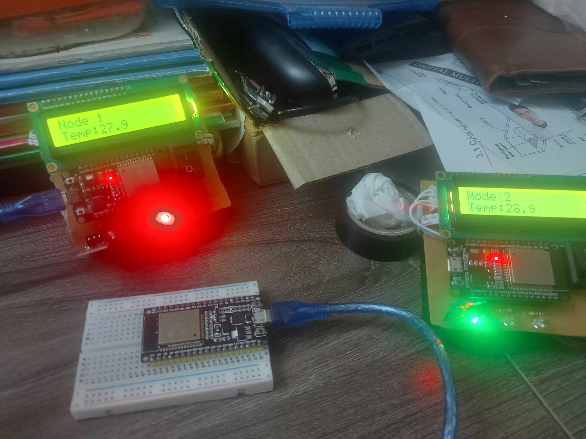

# Wireless Sensor Network for Temperature Monitoring
The project is designed to create a wireless sensor network for temperature monitoring. 
## Overview
The project utilizes Bluetooth Mesh to establish a wireless sensor network. The sensor nodes employ ESP32 Bluetooth modules to read and store sensor values, as well as communicate with the gateway within the network.
# Hardware 
Esp32 Dev Module
Ds18b20 Temperature sensor
LCD1602
Red/Yellow/Green Led
# Features
Main features of the sensor node:
1. Reading environmental temperature and sending data to the Thingsboard interface.
2. Displaying temperature values on an LCD.
3. Controlling LED lights based on temperature thresholds.
4. Sleeping to power-saving
5. Changing the temperature threshold from the interface/gateway.
   
Here is an illustrative image of a sensor node.

